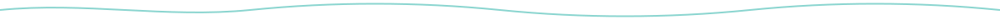
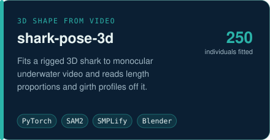
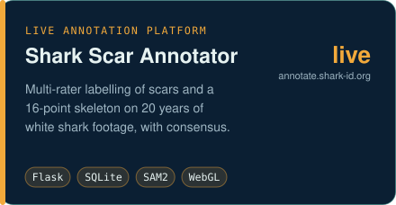
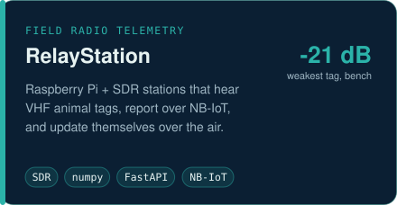
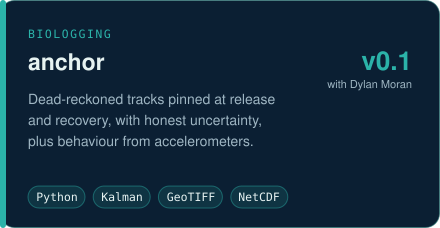
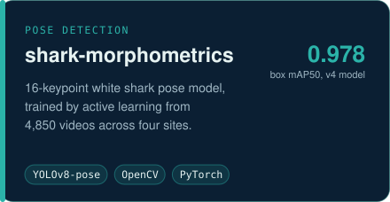
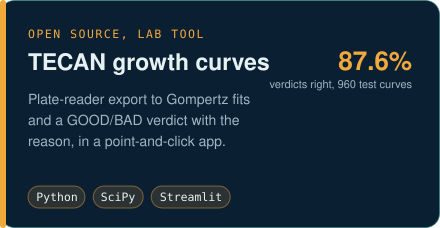

  

  
  
  

I build the software and hardware that let a small lab measure wild animals it can
rarely touch: models that read 3D shape off underwater video, radio stations that
hear tagged animals from a solar panel on a pole, and the labelling tools that turn
a semester of student attention into data a paper can stand on.

B.S. Marine Science, CSU Monterey Bay (2026). FathomNet intern at MBARI, summer 2026.
White sharks with the Ocean Predator Ecology Lab. AAUS scientific diver.

## What I'm building

<table>
<tr>
<td width="50%"></td>
<td width="50%"></td>
</tr>
<tr>
<td></td>
<td></td>
</tr>
<tr>
<td></td>
<td></td>
</tr>
</table>

Every number on these cards is copied from the project's own measured results, with the
caveats kept below. Most of this code is private while the papers are in progress;
architecture notes and public skeletons are linked as they are released.

### shark-pose-3d

White sharks cannot be weighed, so body condition has to come from video. A 16-keypoint
pose detector and SAM2 silhouettes drive a fit of a rigged 3D shark model over a window
of frames, and the fit is read as a girth field along the body.

Run over the archive: 1,011 single-window records on 250 individuals. Length proportions
and girth-profile shape are quotable per animal today. Absolute girth is not yet: on a
known-truth control the fitter reads 7 to 12 % wide, and certifying it needs an external
width measurement. The 2D pose model it builds on (shark-morphometrics v4, 689 training images) scores 0.978 box mAP50 and
0.578 pose mAP50; pose is the number that is still climbing.

### Shark Scar Annotator

Twenty years of footage from four California sites, and 10 to 20 undergraduates a
semester. The platform turns that into multi-rater labels: scar boxes and types, a
16-point skeleton, a prototype 3D pin on a shark model, and consensus that treats "I looked and
there is no scar" as a vote. Live at [annotate.shark-id.org](https://annotate.shark-id.org).

### RelayStation

Radio tags on animals beep once every 1.7 seconds at 151 MHz. A RelayStation is a
Raspberry Pi and a software-defined radio that listens for them all day, validates the
pulse pattern, and reports over WiFi or NB-IoT cellular to a central server that also
ships its code updates. A solar variant runs standalone with an e-ink display.

The rebuilt detector hears a tag about 30 dB fainter than the old one on the bench. That
is a synthetic-noise measurement; real sites have heavier tails, and the outdoor range
walk that converts it into distance has not been redone yet.

### anchor

Accelerometer tags on leopard sharks and bat rays record how an animal moved but not
where. `anchor` dead-reckons the track and pins it at the two points we do know, release
and recovery, so the uncertainty is honest in the middle. Built with Dylan Moran.

<picture>
  <source media="(prefers-color-scheme: dark)" srcset="assets/anchor-track-dark.png">
  
</picture>

Synthetic deployment, rendered by `anchor gallery`. No tag data shown.

## Also

| Project | What it is | Status |
|---|---|---|
| [TECAN Growth Curve Analysis](https://github.com/dbold23/TECAN-Growth-Curve-Analysis-Pipeline) | Plate reader to Gompertz fits with a reasoned GOOD/BAD verdict; right on 87.6 % of 960 known-answer curves | public |
| [JueLab Toolbox](https://github.com/dbold23/JueLab_Toolbox) | Shared analysis scripts for the Jue lab (CSUMB) | public |
| [camwaveheight](https://github.com/dbold23/camwaveheight) | Wave height from a pier webcam, checked against CDIP buoys | public, archived |
| PorpoiseID | Harbor porpoise re-identification from dorsal fins; 198 individuals, 30.5 % rank-1 on a held-out future year | private |
| FathomNet | MBARI summer 2026 internship on the open ocean imagery database and its tools | [fathomnet-py fork](https://github.com/dbold23/fathomnet-py) |

## Tools I reach for

  
  
  
  
  
  
  
  
  
  
  

<picture>
  <source media="(prefers-color-scheme: dark)" srcset="https://raw.githubusercontent.com/dbold23/dbold23/output/snake-dark.svg">
  
</picture>

Artwork in this README is generated by <code>tools/build_assets.py</code>; each number in it names its source.
