<!-- Hello, source reader. Every shark on this page is a 3D model or a photo; none of them were asked to spin. -->

  

  
  
  
  

<b>I build the tools that measure wild animals we can rarely touch.</b> 
CSU Monterey Bay marine science, 2026 · MBARI FathomNet intern · AAUS scientific diver

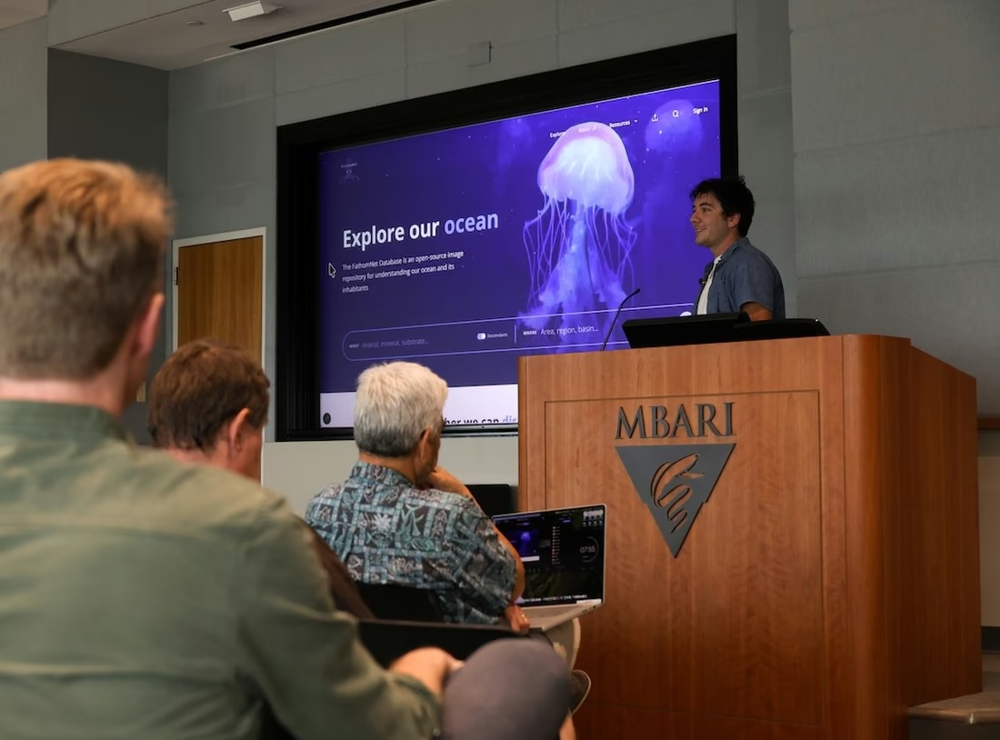 
<b>Presenting my summer internship work at MBARI</b>, with the FathomNet database on screen.

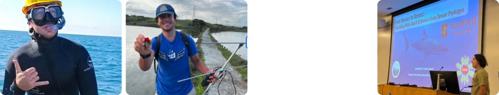

## Let's work together

I'm looking for collaborators, field partners and labs with data. Each project lists what needs work at the top of its code skeleton.

| Project | What needs work |
|---|---|
| [shark-pose-3d](https://github.com/dbold23/shark-pose-3d-skeleton#collaborate) | Absolute girth calibration (drone or phantom); more views of the same animal |
| [Shark Scar Annotator](https://github.com/dbold23/shark-scar-annotator-skeleton#collaborate) | Inter-rater evidence on real scars; expert answer keys; other scar archives |
| [RelayStation](https://github.com/dbold23/relaystation-skeleton#collaborate) | The outdoor range walk; noise captures from new sites; field partners with VHF tags |
| [anchor](https://github.com/dbold23/anchor-track-skeleton#collaborate) | Ground-truth tracks from paired tags and drones; speed calibration per species |
| [TerraMesh](https://github.com/dbold23/terramesh-skeleton#collaborate) | Field accuracy tests; on-device testing; intertidal and cave survey partners |

  
  
  
  

The first buttons open a short public form (needs a GitHub account). No account, or rather keep it private? Email <a href="mailto:daniel.sambold@gmail.com">daniel.sambold@gmail.com</a> or message me on <a href="https://www.linkedin.com/in/daniel-sambold-620b37221">LinkedIn</a>.

## Work

<table>
<tr>
<td width="33%"><a href="#shark-pose-3d">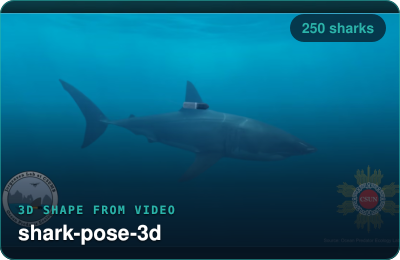</a></td>
<td width="33%"><a href="https://annotate.shark-id.org">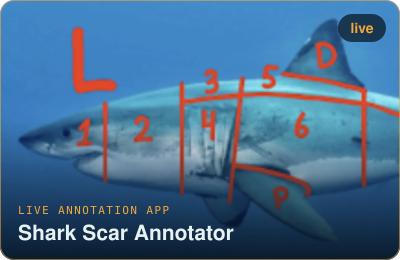</a></td>
<td width="33%"><a href="https://dbold23.github.io/demos/relaystation/">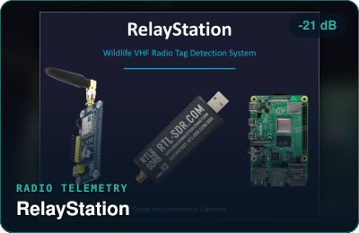</a></td>
</tr>
<tr>
<td><a href="#anchor">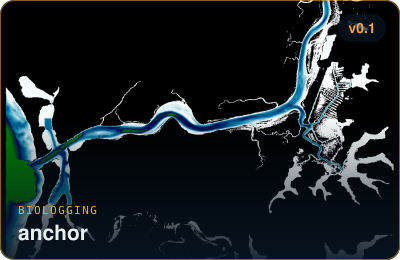</a></td>
<td><a href="https://dbold23.github.io">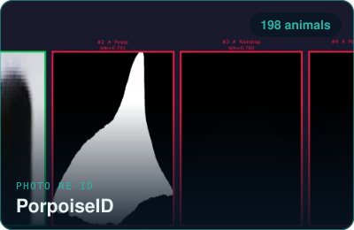</a></td>
<td><a href="https://github.com/dbold23/fathomnet-py">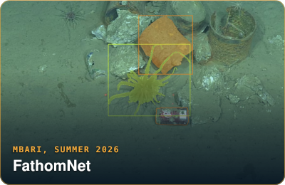</a></td>
</tr>
<tr>
<td><a href="https://github.com/dbold23/TECAN-Growth-Curve-Analysis-Pipeline">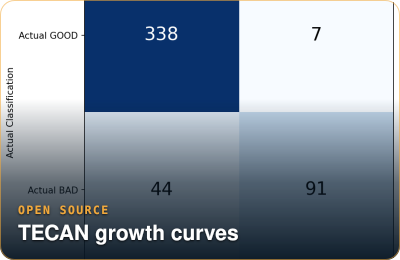</a></td>
<td><a href="https://dbold23.github.io">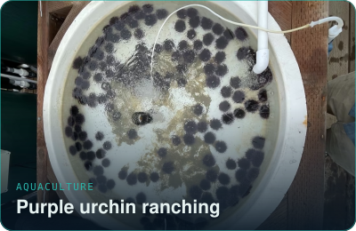</a></td>
<td><a href="https://dbold23.github.io">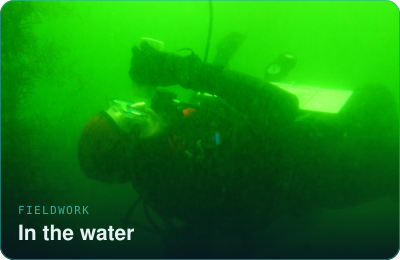</a></td>
</tr>
</table>

Click a tile: live app, interactive dashboard demo, code, or the story on my site.

## In motion

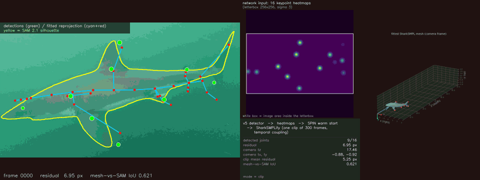

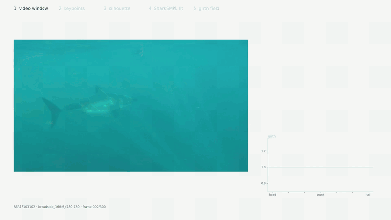

One shark, start to finish: video window, keypoints, silhouette, 3D fit, girth field

<table>
<tr>
<td width="50%">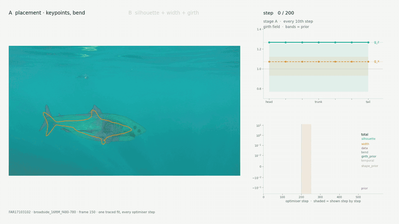</td>
<td width="50%">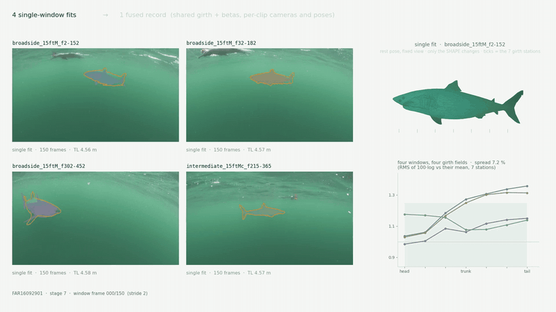</td>
</tr>
<tr>
<td align="center">The optimiser converging, step by step</td>
<td align="center">Four video windows fused into one shape</td>
</tr>
<tr>
<td></td>
<td>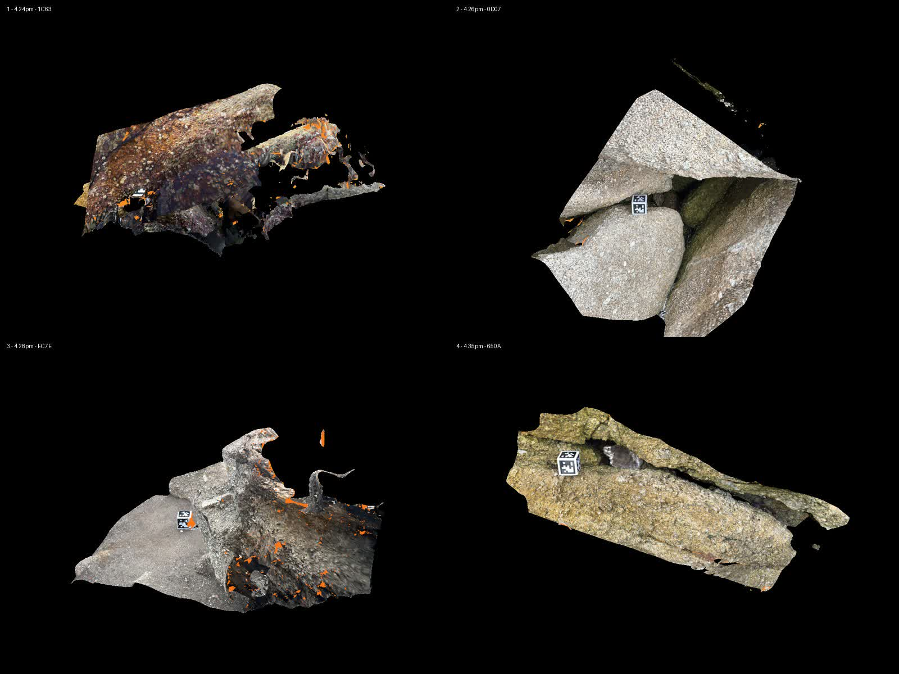</td>
</tr>
<tr>
<td align="center">TerraMesh: an abalone cave scanned with an iPhone</td>
<td align="center">Four different caves, scanned 23 September</td>
</tr>
</table>

## Spin it in 3D (weeeeeee)

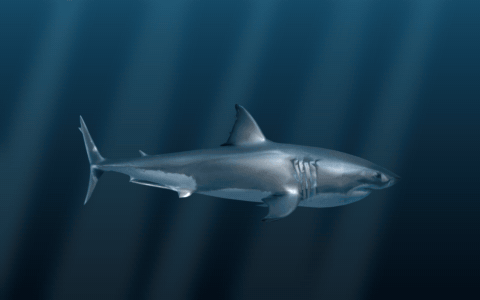

<table>
<tr>
<td width="33%"><a href="assets/white-shark.stl">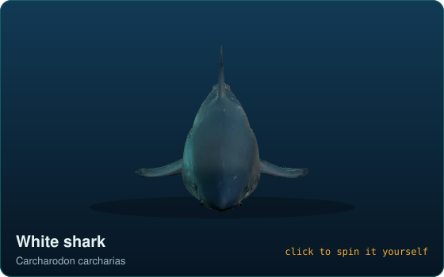</a></td>
<td width="33%"><a href="assets/leopard-shark.stl">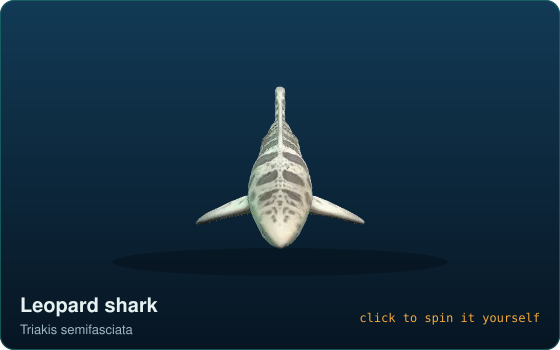</a></td>
<td width="33%"><a href="assets/relay-station-revg.stl">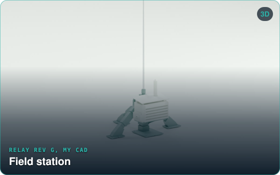</a></td>
</tr>
</table>

<a href="assets/sevengill-handling-dummy.stl">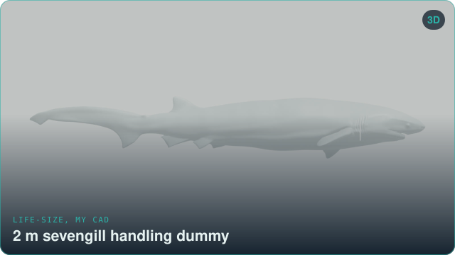</a> Life-size 2 m sevengill handling dummy; prints in 10 segments

Click one to open it in GitHub's 3D viewer: drag to orbit, scroll to zoom. Hover for a word from the models.

## Where I work

<table><tr>
<td width="42%">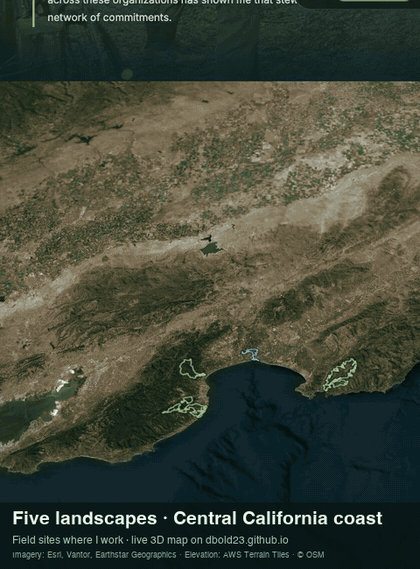</td>
<td width="58%">Five landscapes where I have done conservation and fieldwork, flown over on real satellite imagery and terrain from <a href="https://dbold23.github.io">my website</a>.  Imagery: Esri, Vantor, Earthstar Geographics. Terrain: AWS Terrain Tiles. Boundaries: OpenStreetMap contributors.</td>
</tr></table>

## Look inside

<b>shark-pose-3d</b> · 3D body shape of free-swimming white sharks

 

250 individuals fitted. Length proportions are quotable; absolute girth reads 7 to 12 % wide on a known-truth control and waits on an external calibration. Re-ID works on the trailing edge of the dorsal fin. <a href="https://github.com/dbold23/shark-pose-3d-skeleton">Code skeleton.</a>

<b>Shark Scar Annotator</b> · multi-rater labels on 20 years of footage

 
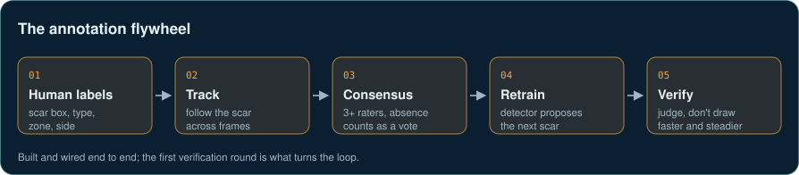

Live for the lab at <a href="https://annotate.shark-id.org">annotate.shark-id.org</a>. Consensus counts "no scar here" as a vote. <a href="https://github.com/dbold23/shark-scar-annotator-skeleton">Code skeleton.</a>

<b>RelayStation</b> · Pi + SDR stations that hear radio-tagged animals

 

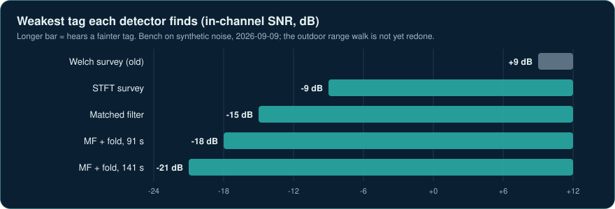

About 30 dB fainter than the old detector, on a synthetic-noise bench; the outdoor range walk is next. <a href="https://dbold23.github.io/demos/relaystation/">Try the dashboard demo</a> or read the <a href="https://github.com/dbold23/relaystation-skeleton">code skeleton</a>.

<b>anchor</b> · biologger tracks pinned at release and recovery

 
<picture>
  <source media="(prefers-color-scheme: dark)" srcset="assets/anchor-track-dark.png">
  
</picture>

Synthetic deployment. Built with Dylan Moran. <a href="https://github.com/dbold23/anchor-track-skeleton">Code skeleton.</a>

<b>TerraMesh</b> · walk a site with an iPhone, get a 3D habitat map

 

Sparse points, dense cloud, mesh, textured model: one cave, stage by stage. Evidence photos placed in 3D with ARKit, cube-scaled photogrammetry afterwards, and field-station workers for sound, photo ID and individuals. <a href="https://github.com/dbold23/terramesh-skeleton">Code skeleton.</a>

## Tools

  
  
  
  
  
  
  
  
  
  
  

psst...

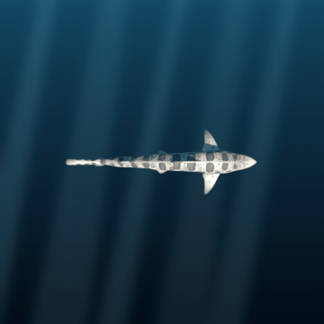 The leopard shark, still chasing its tail.

No sharks were harmed in the making of this README. Several were spun quite a lot.

